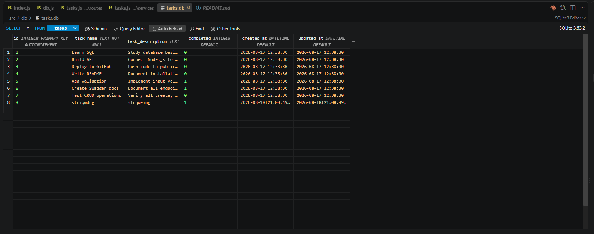

# Task Management API

A simple CRUD API for managing tasks, built with Node.js and Express. Fully documented with Swagger UI for easy testing.

## Assignment Notes

This repo contains weekly branches for the FlyRank AI Internship Backend Program.
- Each week has its own branch
- Each branch contains multiple commits with a final commit of each branch represents the assignment turn-in.
- Main branch contains stable, merged versions

## How to Run from Github

**This assignment is A2, so ensure to select the Week 3 A2 branch before cloning.**

1. Clone the repository:
   ```bash
   git clone <repository-url>
   cd <repository-name>
   ```

2. Install dependencies through terminal:
   ```bash
   npm install
   ```

3. Start the server:
   ```bash
   npm run dev
   ```

4. Test the API:
   - The API will start on `http://localhost:3000`
   - Visit `http://localhost:3000/docs` for Swagger UI
   - Or use curl: `curl http://localhost:3000/tasks`

## A2: Why was SQLite chosen?
1. SQLite doesn't need a separate database server running. The database file lives directly in the project.
2. Requires no credentials or connection strings, simple enough for learning purposes
3. Sqlite has a synchronous API it works well with such as better-sqlite3 which is javascript friendly and is easy to learn.
### Database Location
`project-root/src/db/tasks.db`
### Database Query Exploration

**1. Find tasks updated in the last 24 hours:**
```sql
SELECT * FROM tasks 
WHERE updated_at > datetime('now', '-1 day');
```

**2. Get tasks by completion status:**
```sql
SELECT * FROM tasks WHERE completed = 1;  -- Completed tasks
SELECT * FROM tasks WHERE completed = 0;  -- Open tasks
```

**3. Get tasks ordered by creation date (newest first):**
```sql
SELECT * FROM tasks ORDER BY created_at DESC;
```
#### Database Viewer
For my database viewer, I installed a VSCode extension called SQLite3 Editor, which allows me to open db files and run SQL queries all within VSCode.


---