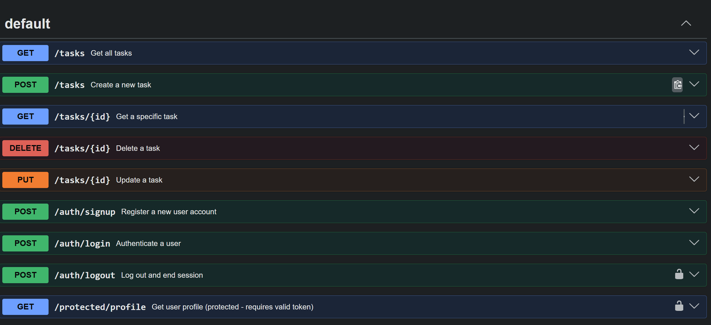

# Task Management API

A simple CRUD API for managing tasks, built with Node.js and Express. Fully documented with Swagger UI for easy testing.

## Assignment Notes

This repo contains weekly branches for the FlyRank AI Internship Backend Program.
- Each week has its own branch
- Each branch contains multiple commits with a final commit of each branch represents the assignment turn-in.
- Main branch contains stable, merged versions

## How to Run from Github

**This assignment is A3, so ensure to select the Week 3 A3 branch before cloning.**

1. Clone the repository:
   ```bash
   git clone <repository-url>
   cd <repository-name>
   git checkout week-3-A3/containerize-your-stack
   ```

2. Install dependencies through terminal:
   ```bash
   npm install
   ```

3. **Important: Docker Desktop is required to run the full stack (API + PostgreSQL database).**

4. Start the server and database:
   ```bash
   docker compose up
   ```

5. Stop the server and database:
   ```bash
   docker compose down
   ```

6. Test the API:
   - The API will start on `http://localhost:3000`
   - Visit `http://localhost:3000/docs` for Swagger UI
   - Or use curl: `curl http://localhost:3000/tasks`

### Swagger UI with Bearer Auth


---