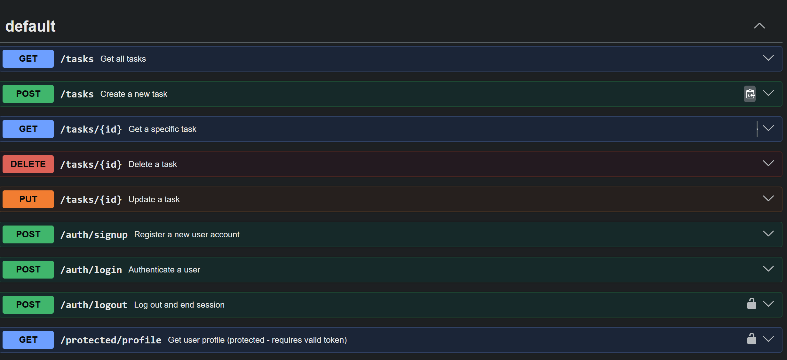

# Task Management API

A simple CRUD API for managing tasks, built with Node.js and Express. Fully documented with Swagger UI for easy testing.

## Assignment Notes

This repo contains weekly branches for the FlyRank AI Internship Backend Program.
- Each week has its own branch
- Each branch contains multiple commits with a final commit of each branch represents the assignment turn-in.
- Main branch contains stable, merged versions

## How to Run from Github

**This assignment is A3, so ensure to select the Week 3 A3 branch before cloning.**

1. Clone the repository:
   ```bash
   git clone <repository-url>
   cd <repository-name>
   git checkout week-3-A3/containerize-your-stack
   ```

2. Install dependencies through terminal:
   ```bash
   npm install
   ```

3. **Important: Docker Desktop is required to run the full stack (API + PostgreSQL database).**

4. Start the server and database:
   ```bash
   docker compose up
   ```

5. Stop the server and database:
   ```bash
   docker compose down
   ```

6. Test the API:
   - The API will start on `http://localhost:3000`
   - Visit `http://localhost:3000/docs` for Swagger UI
   - Or use curl: `curl http://localhost:3000/tasks`

### Swagger UI with Bearer Auth



---

## A17: POST /enrich — an LLM behind the API

Takes a scraped book record and returns clean, validated JSON: what kind of book it is, a one-sentence
summary, and any problems spotted in the description. The full specification — including the closed lists
and the "it must never" rules — is in [JOB-CARD.md](./JOB-CARD.md).

### Run it

```bash
cp .env.example .env      # then fill in your own values
npm install
node --env-file=.env index.js
```

Set `LLM_STUB=1` in `.env` to skip the model entirely and get a fixed schema-valid answer. Build against
the stub; spend real calls only when you actually want to see what a model says.

### Try it — a valid request

```bash
curl -X POST http://localhost:3000/enrich \
  -H "Content-Type: application/json" \
  -d "{\"title\":\"Sapiens: A Brief History of Humankind\",\"description\":\"A sweeping account of how Homo sapiens came to dominate the planet.\"}"
```

```json
{
  "category": "other",
  "summary": "Stubbed summary for \"Sapiens: A Brief History of Humankind\".",
  "quality_flags": [],
  "confidence": 0.1,
  "reason": "Stub mode is on, so no model was consulted."
}
```

### Try it — a deliberately broken request

```bash
curl -X POST http://localhost:3000/enrich \
  -H "Content-Type: application/json" \
  -d "{\"description\":\"no title here\"}"
```

```json
{ "error": "title: title is required and must be a string", "field": "title" }
```

Input is validated before anything else happens, and the response names the offending field. Every request
rejected here is a model call that was never paid for — which matters on a tier allowing 50 calls a day.

### Swapping the provider

Three environment variables are the only difference between a model running in a datacentre and one running
on your own laptop. No code changes:

| Variable | OpenRouter (hosted) | Ollama (local) |
|---|---|---|
| `LLM_BASE_URL` | `https://openrouter.ai/api/v1` | `http://localhost:11434/v1/` |
| `LLM_API_KEY` | your real key | the literal string `ollama` |
| `LLM_MODEL` | `openrouter/free` | `gemma3:1b` |

That is why none of them is named after a company.

### The prompt

The prompt lives in [prompts/enrich-v1.md](./prompts/enrich-v1.md), not in a string inside the route, so it
can be versioned, reviewed and diffed like any other code. It has five parts: the role, the exact output shape
with a definition for every category and flag, the rules, what to do when unsure, and three examples (typical,
ambiguous and a prompt-injection attempt).

The book is sent as a separate `user` message and JSON-encoded, so text in a scraped description cannot
break out of its quotes or pose as part of the instructions. Calls use `temperature: 0`.

### First real answers (prompt v1, 2026-10-05)

Three real records from the Week 5 scraper, sent with `LLM_STUB=0`:

| Book | Category returned | Correct? | Model that answered |
|---|---|---|---|
| A Light in the Attic | `poetry` | Yes — the format-over-audience tie-break worked | `dots-studio/dots-3-note-preview:free` |
| Sapiens | `nonfiction` | Yes | `nvidia/nemotron-3.5-lightning:free` |
| Scott Pilgrim's Precious Little Life | `graphic_novel` | Yes | `cohere/north-mini-code:free` |

All three answers parsed as JSON and passed the output schema.

**What surprised me:**

- **A different model answered every call.** `openrouter/free` routes each request to whichever free model is
  available, so `temperature: 0` does not guarantee the same answer twice — the model itself changes. That
  matters for the Stage 5 eval: a score can move because the router picked a different model, not because the
  prompt changed.
- **Same shape, different formatting.** One answer started with two blank lines, one was pretty-printed over
  several lines, one was a single compact line. None used a code fence, but nothing guarantees that. A parser
  has to cope with all of these.
- **The schema can't catch wrong facts.** The Scott Pilgrim summary calls him a "bassist", which is not in
  the description, and the reason calls him "a teenager" when the description says he is 23. Both answers
  passed validation, because the schema checks shape, not truth. The model also identified the book as a comic
  from outside knowledge, since the description never says so.
- **Confidence was 0.95 every time.** Three different models, three books, the same number. As it stands,
  `confidence` carries almost no information.
- **The flags are judgement calls.** Sapiens and A Light in the Attic were flagged for `promotional_language`;
  Scott Pilgrim ("totally sweet", "seriously mind-blowing") was not. The line between hype and a lively
  narrative voice is fuzzy, and different models draw it differently.

---
